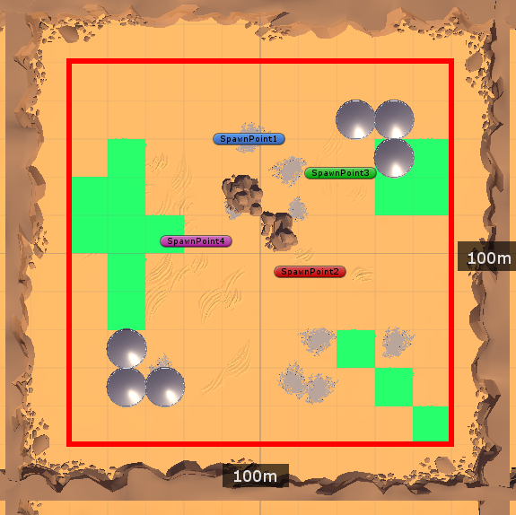

# Game Rules

## Game Flow

### Waiting for Players
The game will wait as long as the number of active players is less than the
minimum number of players required to start the game. The game will begin
immediately once there is a sufficient number of players. Players will lose
control of their tank temporarily.

### Round Start
The game announces the beginning of the game with the round number and then
relinquish control of the tanks back to the players to begin the game.

### Round in Progress
The players will be able to control their tanks and engage in a real-time
battle. Each tank starts with 100 hit points (HP) and will be removed from play
when their health drops below zero. The game will end when there are one or less
tanks left in play.

All tanks will be removed from play when the timer runs out, thus causing a draw
to take place.

### Round End
The game will determine if there is a winner of the given round, and award them
with a victory, if any at all. If a player reaches the win limit, then they will
be declared victorious and the game will move to the game over phase. Otherwise,
the game restarts the game, moving back to the round start phase.

### Game Over
All players will be dropped from the server and the level will be reloaded.

## Entities

### Tank

- Dimensions (LxHxW)
  - 1.5m x 1.7m x 1.6m
  - includes the cannon
- Max Speed: 12 _m/s_
- Turn Speed: 180 _degrees/second_
- Fires one bullet per second

#### Cannon
- Turn Speed: 1 _degrees/second_

### Bullet

- Dimensions (LxHxW)
  - 0.3m x 0.3m x 0.55m
- Max Damage: 100
- Explosion Radius: 5m

## Map and Tiles

- Map
    - Dimensions
        - 100 x 100m
    - Origin is centered
- Tile
    - Dimensions
        - 10m x 10m
    - Types
        - Damage Over Time (DOT) field
        - Obstacle
